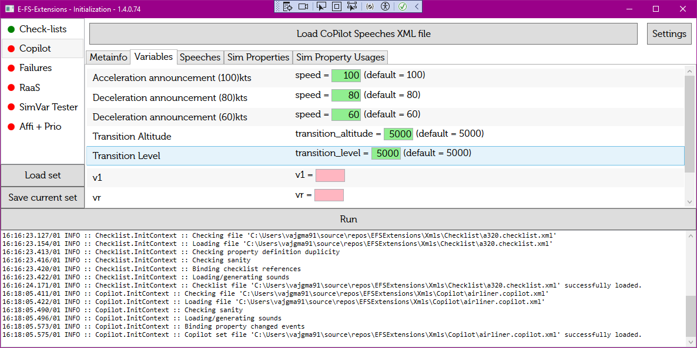

# Copilot Speeches Init

The module init page:

On the init page, there are several tabs:
* Metainfo - (read only) showing the info about currently opened file;
* Variables - all variables required to run the speeches;
* Speeches - (read only) shows all speeches defined in the current file;
* Sim Properties - (read only, debug) shows all properties used by the current file;
* Sim Property Usages - (read only, debug) shows all properties with their respective usage by the speeches in the current file.

## To start the module

1. Load the required file by `Load COPilot Speeches XML file` button.
2. Set all `Variables` in the _Variables_ tab.
3. Adjust `Settings` (if necessary).
4. Set-up all other modules (if necessary).
5. Start all modules by pressing the `Run` button.
