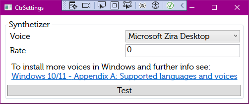

# Copilot Speeches Settings

Copilot Settings allows to se the Syntehtizer used to read the announcements.

### Synthetizer 

Synthetizer is used to generate Checklist speeches if required.

See [Shared/Synthetizer Settings](https://app.gitbook.com/o/eFbPL0xlHGQcXfYjB0ap/s/PdAIOMnAtMPtfMfndwpj/shared/synthetizer-settings).
