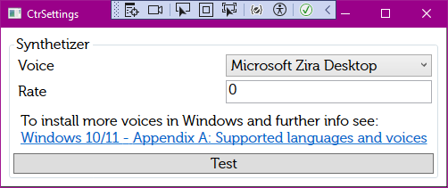

# Synthetizer Settings

A synthetizer is a tool converting the text to sound file (also called as _Text-To-Speech_, _TTS_)

The Synthetizer settings depends on the currently selected Synthetizer. By default, the Microsoft SAPI synthetizer is preset.

Implemented synthetizers:
* Microsoft SAPI
* EleventLabs TTS

## Microsoft SAPI Settings

The Ms SAPI settings are very simple:

* **Voice** - defines the voice used for speech generating. The voices available depends on the Windows version. To add more voices see explanation below.
* **Rate** - defines the speech speed. Negative values decrease speed, positive values increase speed. The default value is 0.

You can use `Test` button to hear demo speech based on the current settings.

### How to add more voices

Other voices in MS SAPI are available at [https://support.microsoft.com/en-us/windows/appendix-a-supported-languages-and-voices-4486e345-7730-53da-fcfe-55cc64300f01](https://support.microsoft.com/en-us/windows/appendix-a-supported-languages-and-voices-4486e345-7730-53da-fcfe-55cc64300f01). 

There, you can firstly select the appropriate voice - note that you should take and use voice using the same language as the speeches (it's hard to convince german-speaking TTS to read english announcements). Then, follow the instructions at the bottom of the page to add the voice in the system. Finally, restart your computer.

## ElevenLabs TTS

TODO

